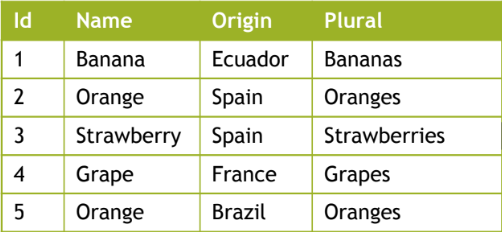
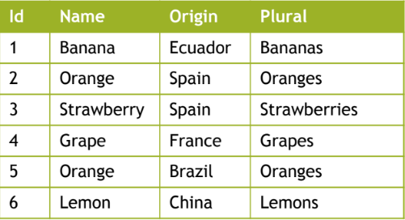
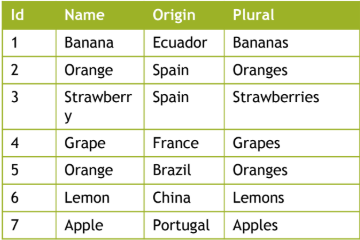

1.2. Create, Update and Delete Data

# 1.2. Create, Update and Delete Data

## Creating new records
### Syntax
```SQL
INSERT INTO <table> [(<column1>[, <column2> ...])]
VALUES(<value1>[, <value2> ...]);
```
### Example
Imagine a table products like:


In which case, this...
```SQL
INSERT INTO Product
VALUES (6, 'Lemon', 'China', 'Lemons');
```
...would result in:


You can also skip a column, and it will be assigned NULL.
If you skip ID (or the table's private key) and it is auto-increment, it will automatically assign your new record an ID.
```SQL
INSERT INTO Product (Name, Origin, Plural)
VALUES('Apple', 'Portugal', 'Apples');
```

## Updating existing records
### Syntax
```SQL
UPDATE <table>
SET <column1> = <value> [, <column2> = <value> ...]
[WHERE <condition>];
```
### Example

```SQL
UPDATE Product
SET Origin = 'Japan'
WHERE Name = 'Strawberry';
```
The row with Name = Strawberry (ID = 3 in this case) would have it's origin altered to Japan.

## Deleting existing records
### Syntax
```SQL
DELETE FROM <table>
[WHERE <condition>];
```
### Example
```SQL
DELETE FROM Product; -- Deletes all products

DELETE FROM Product
WHERE Name = 'Orange'; -- Deletes all products with Name = Orange
```
### Delete Rules
Is applied to the foreign key.
For example, if a Book has an Author and I delete that book's Author, what will happen to the Book?

- `No Action` will not allow the deletion of Author;
- `Cascade` will delete the Author and any Books associated;
- `SET NULL` will delete the Author and set the Books' foreign key to NULL;
- `SET DEFAULT` will delete the author and set the Books' foreign key to default.

## Transactions
A transaction is the unit of work performed within a database.

If multiple operations are executed inside a single transaction:
- All of them successfully execute;
- One or more of them produce an error, in which case any changes made by the transaction are reverted.

To force one of these, use `COMMIT` or `ROLLBACK`.